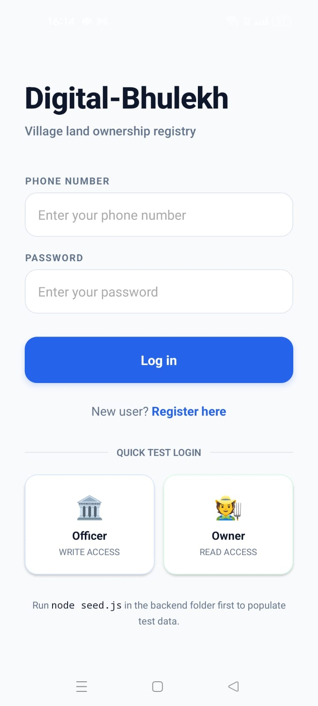
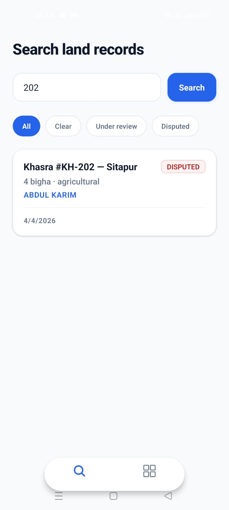
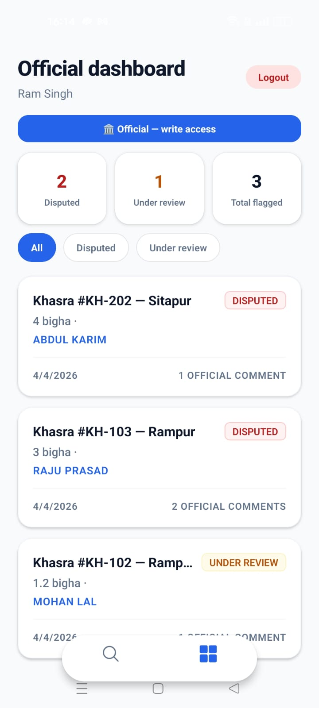
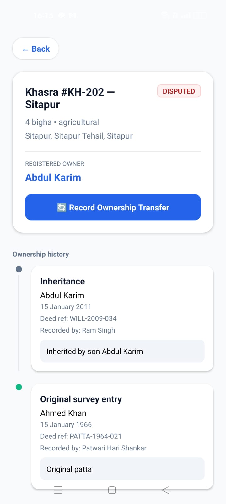
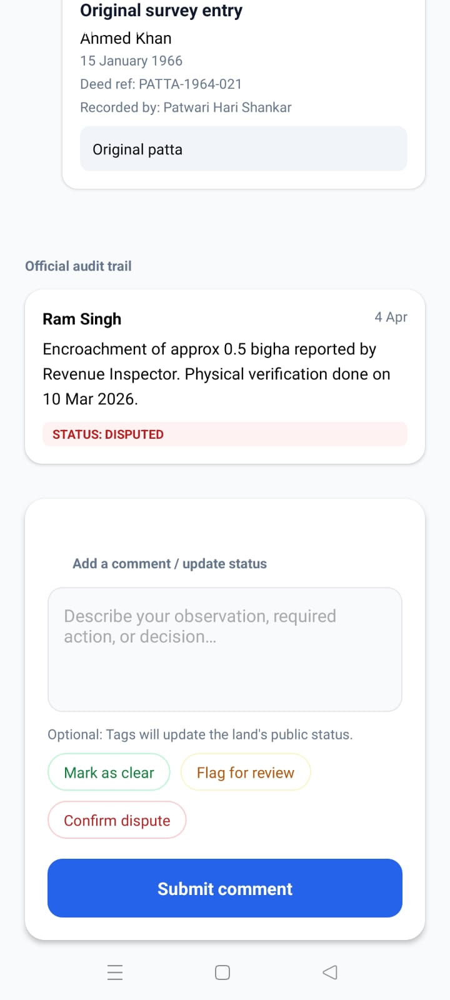
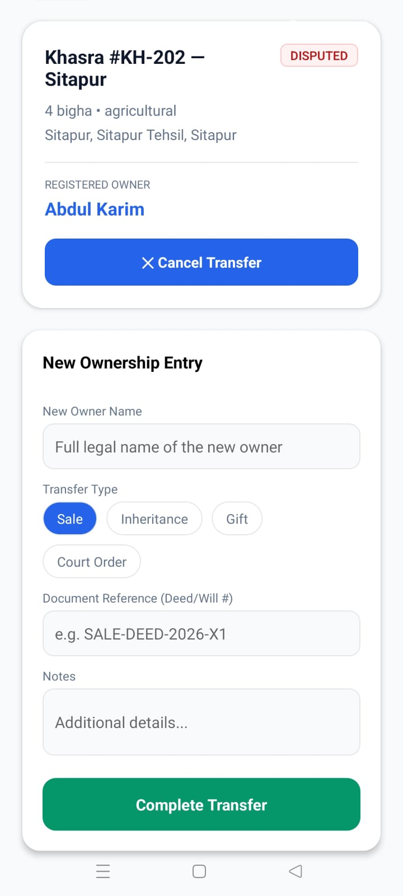
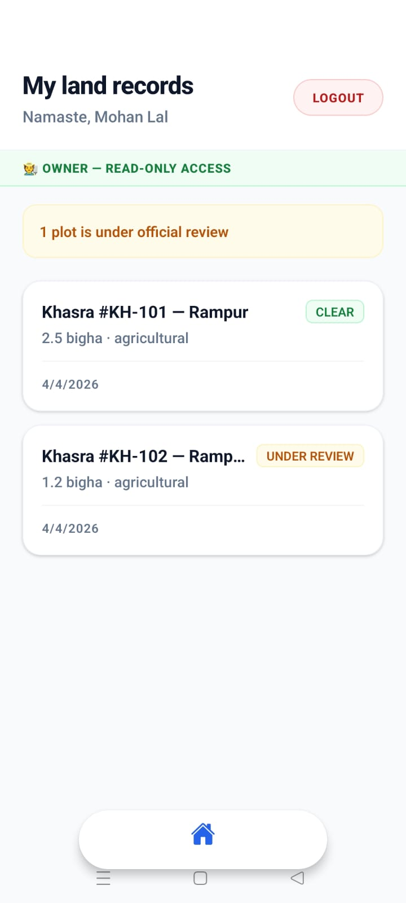
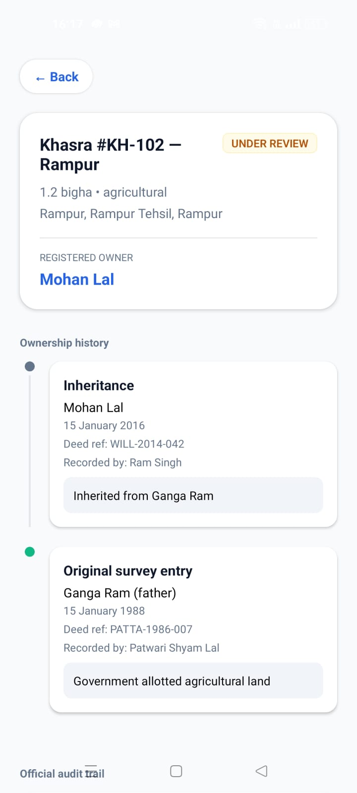
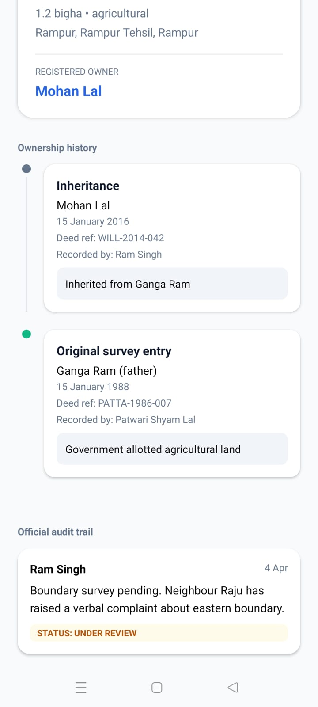

# 🌾 Digital Bhulekh

> A modern digital land ownership registry system designed for villages to ensure **transparent, tamper-resistant, and trackable land records**.

---

## ✨ Features

### 👤 For Land Owners
- 📄 View owned land records
- 📜 Track ownership history
- 🔍 See land status (Clear / Under Review / Disputed)

### 🏛️ For Officials
- 🔎 Search land records
- 📝 Add comments & audit trail
- ⚖️ Update land status
- 🔄 Record ownership transfers
- 📊 Dashboard for flagged lands

---

## 📱 App Screens

### 👨‍💼 Officer Screens

<p align="center">
  
  
  
  
  
  
</p>

### 👤 User Screens

<p align="center">
  
  
  
  
</p>

---

## 🏗️ Tech Stack

| Layer | Technology |
|-------|------------|
| Frontend | ⚛️ React Native (Expo) + Expo Router |
| Backend | 🟢 Node.js + 🚀 Express.js |
| Database | 🍃 MongoDB |
| Auth | 🔐  Token-based auth |

---

## 🧠 Architecture

```
Mobile App (React Native)
        ↓
API Layer (Express.js)
        ↓
  Database (MongoDB)
```

- Role-based access (Owner / Official / Admin)
- Secure API endpoints
- Real-time data consistency

---

## 🔐 Role-Based Access Control

| Role     | Permissions          |
|----------|----------------------|
| Owner    | View only            |
| Official | Modify + Comment     |
| Admin    | Full control         |

---

## 🌍 Problem It Solves

| ❌ Problem | ✅ Solution |
|-----------|------------|
| Manual records are error-prone | Immutable digital tracking |
| High risk of disputes & fraud | Transparent audit trail |
| No transparency in ownership history | Easy access for citizens & officials |

---

## 🚀 Getting Started

### 1️⃣ Clone the repo
```bash
git clone https://github.com/your-username/DigitalLedger.git
cd DigitalLedger
```

### 2️⃣ Run the backend
```bash
cd backend
npm install
node seed.js   # populate test data
npm start
```

### 3️⃣ Run the frontend
```bash
cd frontend
npm install
npx expo start
```

---

## 🧪 Demo Login

| Role     | Phone      | Password   |
|----------|------------|------------|
| Official | 1111111111 | officer123 |
| Owner    | 2222222222 | user123    |

---

## 🔮 Future Scope

- 📍 GIS / Map integration
- 🧾 Blockchain-based record immutability
- 📲 Aadhaar / Gov integration
- 🔔 Notifications for land updates
- 📊 Advanced analytics dashboard

---

## 💡 Unique Points

- ⚡ Real-time land status updates
- 📜 Full ownership timeline
- 🔐 Secure & role-based system
- 🏡 Designed for rural India use case

---

## 🤝 Contributing

Pull requests are welcome!  
For major changes, please open an issue first to discuss what you'd like to change.

---

## 📄 License

This project is licensed under the [MIT License](LICENSE).

---

## 👨‍💻 Author

**Adarsh Pratap Singh**

⭐ If you find this project useful, give it a star!
